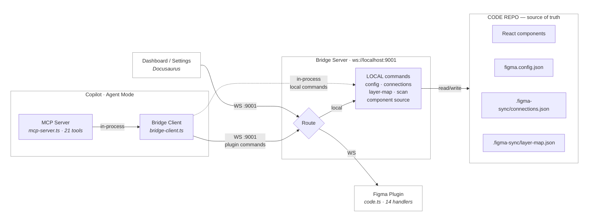

# Architecture

## Vision

Make the **code repo the single source of truth** for UI. Designers and developers collaborate through Figma, but all changes flow through code. Copilot is the bridge.

## System Overview

The bridge sits at the center — see the [Bridge section](/docs/bridge/overview) for details on how it works, all available [commands](/docs/bridge/commands), and the [message protocol](/docs/bridge/protocol).

## Data Flow

### Push (Code → Figma)

1. Developer changes a React component
2. Copilot reads component source + Figma node via bridge
3. Copilot compares properties and presents a diff
4. Developer approves — Copilot applies surgical updates via `bridge_update_node`
5. For new children, Copilot creates instances via `bridge_create_instance`
6. Layer map (`.figma-sync/layer-map.json`) is updated automatically
7. For major overhauls, `generate_figma_design` captures the full page

### Pull (Figma → Code)

1. Designer changes colours, text, or layout in Figma
2. `get_design_context` retrieves the updated design + generated code
3. Copilot diffs the Figma state against current code
4. Developer reviews and accepts changes

### Link (Code ↔ Figma)

1. Developer opens the **Dashboard** and connects to the bridge
2. Bridge fetches live components from Figma plugin + scans project files from config
3. Developer links code components to Figma components via dropdown
4. Links persist in `.figma-sync/connections.json`

## Key Files

### Configuration

| File | Purpose | Created by |
|---|---|---|
| `figma.config.json` | Project config — file key, include/exclude globs, parser | Settings page |
| `.figma-sync/connections.json` | Component links — code component ↔ Figma master component | Dashboard / Copilot push sync |
| `.figma-sync/layer-map.json` | Layer links — sub-components ↔ Figma layers inside a parent frame | Copilot push sync (auto) |
| `.vscode/mcp.json` | MCP server registrations (Figma + figma-bridge) | Manual |

### Source Code

| Directory | Purpose |
|---|---|
| `.figma.config/bridge/src/` | Bridge server, local handlers, MCP server, protocol types |
| `.figma.config/plugin/` | Figma Plugin (code.ts, ui.html, manifest) |
| `.figma.config/docs/src/pages/` | Dashboard + Settings UI |
| `src/components/` | Real project UI components |

## MCP Tool Capabilities

### Official Figma MCP

| Tool | Direction | Rate Limit (Pro) | Plan Required |
|---|---|---|---|
| `generate_figma_design` | Push | ✅ Unlimited | Any |
| `get_design_context` | Pull | 200/day | Any |
| `get_variable_defs` | Pull | 200/day | Any |
| `get_metadata` | Pull | 200/day | Any |
| `add_code_connect_map` | Push | ✅ Unlimited | ⛔ Org/Enterprise |
| `get_code_connect_suggestions` | Pull | 200/day | ⛔ Org/Enterprise |

### Custom Bridge MCP (`figma-bridge`)

See [Bridge Commands](/docs/bridge/commands) for the full list of 21 MCP tools (14 plugin + 7 local) and all bridge commands.

> **Key finding:** Code Connect requires Org/Enterprise plan. We use `figma.config.json` + `.figma-sync/connections.json` (component links) + `.figma-sync/layer-map.json` (sub-component layer links) instead — aligned with Code Connect conventions for future migration.
