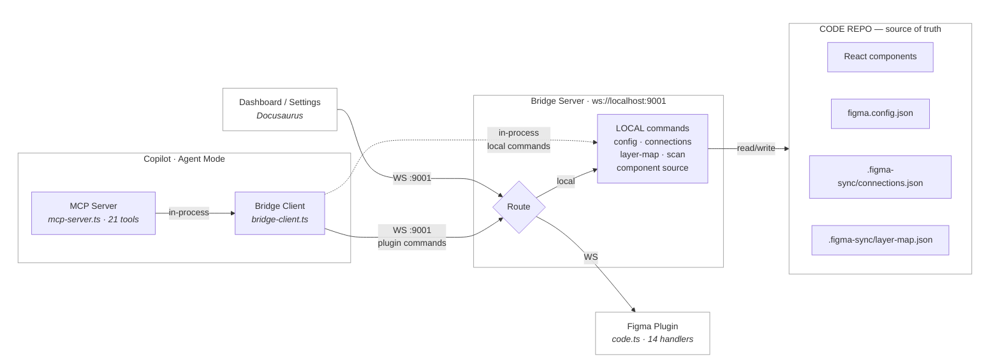

# Bridge Overview

The **Figma Plugin Bridge** enables surgical read/write access to Figma — including the ability to **convert layers into reusable components**, update individual node properties, and manage design tokens on any plan.

## Why a Plugin?

The Figma MCP server and REST API are **read-only** for design file content. They cannot create components, modify nodes, or change the file tree.

| What you need | Figma REST API | Figma MCP | Plugin API |
|---|---|---|---|
| Read nodes | ✅ | ✅ | ✅ |
| Create components | ❌ | ❌ | ✅ |
| Convert frame → component | ❌ | ❌ | ✅ |
| Update text / fills | ❌ | ❌ | ✅ |
| Read/write variables (any plan) | ❌ Enterprise only | ❌ Enterprise only | ✅ |
| Rate limits | 200/day | 200/day | **None** |

The **only** way to programmatically write to a Figma file is the **Figma Plugin API** (`figma.*`), which runs inside the Figma desktop or browser app.

## Architecture

> **Note:** The MCP server (`mcp-server.ts`) uses `bridge-client.ts` — a WebSocket **client** that connects to the bridge. Local commands (config, connections, layer-map, etc.) are handled in-process without a round-trip. Plugin commands are forwarded through the bridge to the Figma plugin.

### Five Pieces

1. **Figma Plugin** — runs inside Figma, executes `figma.*` commands (14 handlers: read, create, update, delete, reorder), connects to bridge via WebSocket
2. **Bridge Server** (`server.ts`) — local WebSocket server (`ws://localhost:9001`) that handles two types of commands:
   - **Local commands** — config, connections, layer-map, component source, project scan — handled directly on the server
   - **Plugin commands** — forwarded to the Figma plugin over WebSocket
3. **Bridge Client** (`bridge-client.ts`) — WebSocket client used by the MCP server to connect to the bridge. Handles local commands in-process and forwards plugin commands through the bridge. This avoids the MCP server starting its own WebSocket server.
4. **Custom MCP Server** (`mcp-server.ts`) — exposes 21 bridge commands as MCP tools that Copilot can call via stdio
5. **Dashboard / Settings UI** — Docusaurus pages that connect to the bridge for config management and component linking

## File Reference

| File | Purpose |
|---|---|
| `src/protocol.ts` | Shared TypeScript types for messages (24 bridge commands) |
| `src/server.ts` | WebSocket bridge server — routes local vs plugin commands |
| `src/bridge-client.ts` | WebSocket client — used by MCP server to connect to bridge without starting a second server |
| `src/local-handlers.ts` | Local filesystem handlers (config, connections, scan, layer map, component source) |
| `src/mcp-server.ts` | MCP server exposing 21 tools to Copilot |
| `figma-plugin/manifest.json` | Figma plugin manifest |
| `figma-plugin/code.ts` | Plugin main thread — 14 command handlers (read, create, update, delete, reorder) |
| `figma-plugin/ui.html` | Plugin UI — WebSocket + status dashboard |
| `figma.config.json` | Project config (created via Settings page) |
| `.figma-sync/connections.json` | Component links — code component ↔ Figma master component |
| `.figma-sync/layer-map.json` | Layer links — sub-components ↔ Figma layers inside parent frames |
| `.vscode/mcp.json` | MCP server registration |
